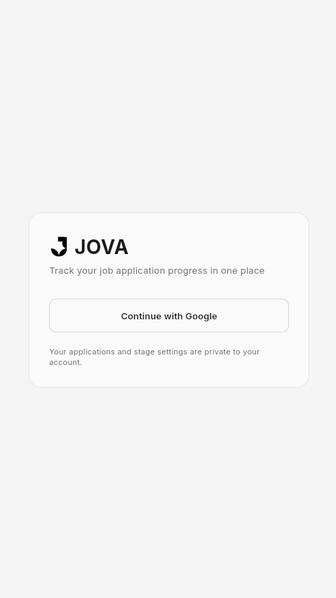
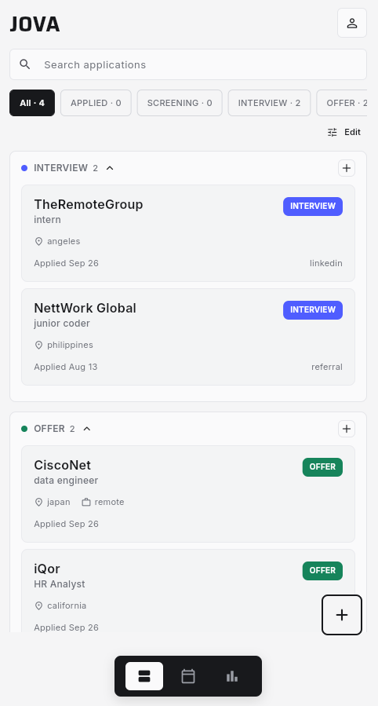
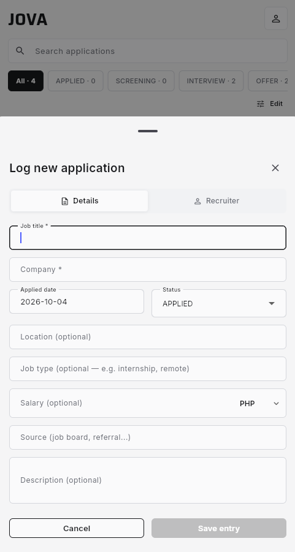
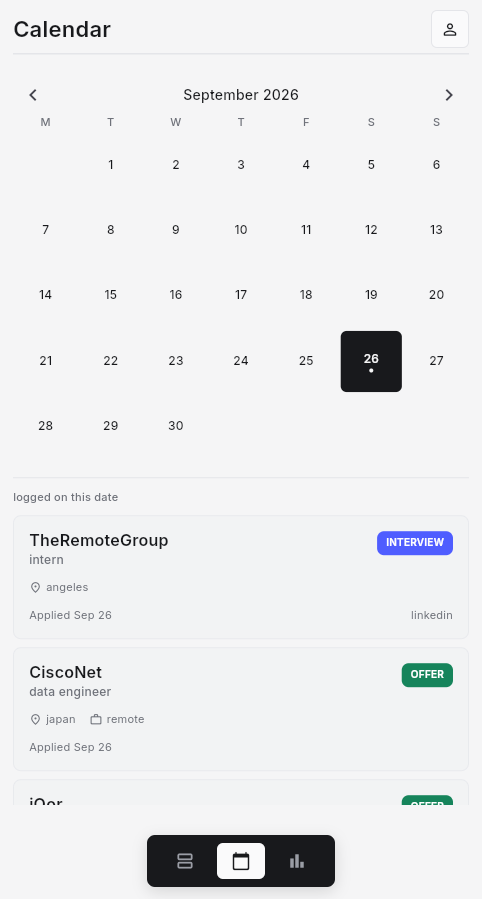
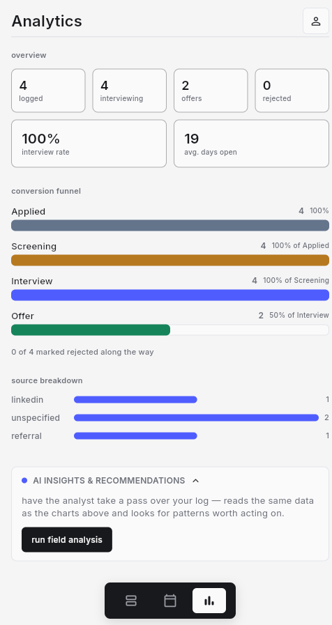
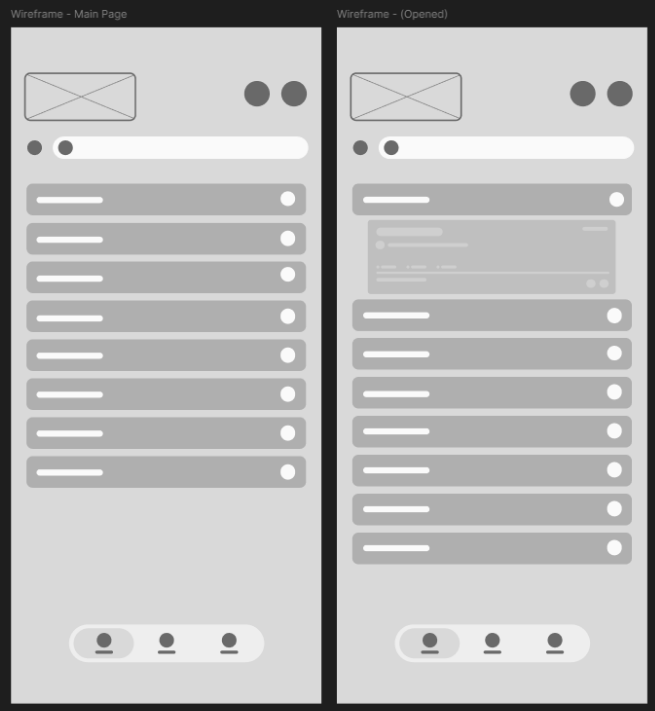

# Mockup and wireframes

JOVA uses a mobile-first interface for recording job applications, checking their hiring stages, and reviewing progress.

## Mockup

Add **actual screenshots or exported mockups** to `docs/assets/`. The image references below are placeholders until those files exist.

### Login


### Dashboard / application tracker


### Add or edit application



### Calendar


### Analytics and AI



## Wireframes




### Screen flow

```text
Open JOVA
    |
    v
Google Sign-in (if signed out)
    |
    v
Dashboard / Application Tracker
    |-- Add or edit an application
    |-- View or manage hiring stages
    |-- Open Calendar
    |-- Open Analytics
    |      `-- Request AI Insights & Recommendations
    `-- Sign out -> Login
```

## Screens:

### Login screen
Shows the JOVA identity and Google authentication button. A successful sign-in opens the application tracker.

### Dashboard screen
Displays saved job applications, their hiring stages, and stage counts. Users can add, view, and update entries or open stage controls.

### Application form
Collects the information needed to create or edit a tracked application. Saved changes appear in the tracker.

### Calendar screen
Provides a calendar-based view of application-related records. Users navigate here using the app's navigation controls.

### Analytics screen
Summarizes recorded applications and their distribution across hiring stages. The AI feature can generate on-demand insights and recommendations based on available data.

### Stage editing interface
Allows users to manage stage labels and ordering without requiring a separate full-screen page.
