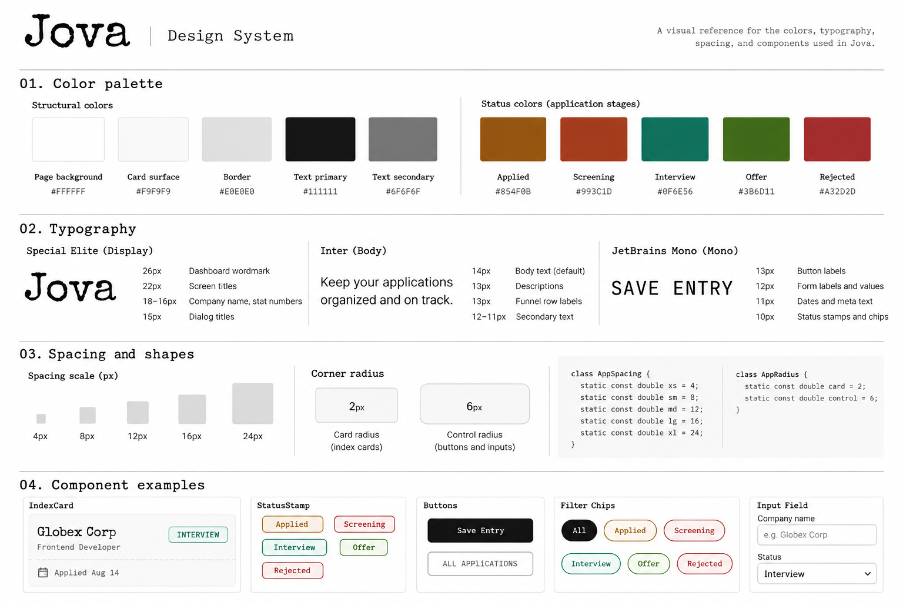

# Design system

JOVA uses a white palette, minimal borders, compact controls, and typography inspired by index cards. Its core design tokens are defined as `static const` values in `lib/theme/field_log_theme.dart` through the `FieldLog` class.




## Palette:

### Structural tokens

| Token | Hex | Role | Reported contrast on card |
| --- | --- | --- | --- |
| `color-bg-page` | `#F3EEE1` | App background | — |
| `color-surface-card` | `#FBF8F0` | Index-card surface | — |
| `color-border` | `#DAD2BC` | Card borders, dashed rules | — |
| `color-text-primary` | `#2C2820` | Headings, company name | 3.8:1 (reported PASS) |
| `color-text-secondary` | `#6F6756` | Role, metadata | 5.3:1 (reported PASS) |

### Status tokens

| Token | Hex | Role | Reported contrast on card |
| --- | --- | --- | --- |
| `color-stage-applied` | `#854F0B` | Applied stamp | 6.3:1 (PASS) |
| `color-stage-screening` | `#993C1D` | Screening stamp | 6.6:1 (PASS) |
| `color-stage-interview` | `#0F6E56` | Interview stamp | 5.9:1 (PASS) |
| `color-stage-offer` | `#3B6D11` | Offer stamp | 5.9:1 (PASS) |
| `color-stage-rejected` | `#A32D2D` | Rejected stamp | 6.7:1 (PASS) |

*Contrast ratios and PASS labels above are carried over from the supplied design specification, not independently retested here. In particular, verify the primary-text contrast against the accessibility standard applicable to its size.*

The five stage colors do not use a `ThemeExtension`. The `FieldLog` class exposes them directly (for example, `FieldLog.textPrimary` or `application.status.color`). The Material `ColorScheme` uses `stageInterview` as its seed so default dialogs and dropdowns remain visually consistent.

```dart
class FieldLog {
  // Color tokens
  static const bgPage = Color(0xFFF3EEE1);
  static const surfaceCard = Color(0xFFFBF8F0);
  static const border = Color(0xFFDAD2BC);
  static const textPrimary = Color(0xFF2C2820);
  static const textSecondary = Color(0xFF6F6756);

  static const stageApplied = Color(0xFF854F0B);
  static const stageScreening = Color(0xFF993C1D);
  static const stageInterview = Color(0xFF0F6E56);
  static const stageOffer = Color(0xFF3B6D11);
  static const stageRejected = Color(0xFFA32D2D);

  // Shape tokens
  static const radiusCard = 2.0;
  static const radiusControl = 6.0;

  // Spacing tokens
  static const space4 = 4.0;
  static const space8 = 8.0;
  static const space12 = 12.0;
  static const space16 = 16.0;
  static const space24 = 24.0;

  static ThemeData themeData() {
    return ThemeData(
      scaffoldBackgroundColor: bgPage,
      colorScheme: ColorScheme.fromSeed(seedColor: stageInterview),
      textTheme: GoogleFonts.interTextTheme(),
      useMaterial3: true,
    );
  }
}
```

## Type scale

The initial design proposed a fixed five-slot `TextTheme` with font sizes of 11, 12, 14, 16, and 22 px. During implementation, the fixed scale proved too rigid for statistics, dialog headings, and card titles. The final design therefore uses three named, parameterized style functions. Each widget explicitly selects its size using these functions rather than creating unrelated raw `TextStyle` values.

| Function | Font | Sizes used (px) | Usage |
| --- | --- | --- | --- |
| `FieldLog.display()` | Special Elite | 26, 22, 20, 18, 16, 15 | Wordmark, screen titles, company names, stat numbers, dialog titles, AI headline |
| `FieldLog.body()` | Inter | 14 (default), 13 | Paragraphs, descriptions, funnel row labels, calendar month header |
| `FieldLog.mono()` | JetBrains Mono | 13, 12, 11, 10 | Buttons, form labels and values, dates, source labels, stamps, chips, metadata |

Examples to include on the visual sheet:

- **Jova** — `display(size: 26)`, dashboard wordmark
- **Globex Corp** — `display(size: 16)`, company name on `IndexCard`
- **reads the same data as the charts above and says what it actually means.** — `body(size: 13)`, AI description
- **SAVE ENTRY** — `mono(size: 13)`, form button
- **applied Aug 14** — `mono(size: 11)`, card metadata
- **INTERVIEW** — `mono(size: 10)`, `StatusStamp`

```dart
static TextStyle display({double size = 22, Color? color}) =>
    GoogleFonts.specialElite(fontSize: size, color: color ?? textPrimary);

static TextStyle mono({double size = 12, Color? color, FontWeight? weight}) =>
    GoogleFonts.jetBrainsMono(
      fontSize: size,
      color: color ?? textSecondary,
      fontWeight: weight,
    );

static TextStyle body({double size = 14, Color? color, FontWeight? weight}) =>
    GoogleFonts.inter(
      fontSize: size,
      color: color ?? textPrimary,
      fontWeight: weight,
    );
```

## Spacing

The spacing scale uses five increments: **4, 8, 12, 16, and 24 px**. Show them as proportionally sized bars in the design-system visual.

| Token | Value |
| --- | --- |
| `space4` / `AppSpacing.xs` | 4 px |
| `space8` / `AppSpacing.sm` | 8 px |
| `space12` / `AppSpacing.md` | 12 px |
| `space16` / `AppSpacing.lg` | 16 px |
| `space24` / `AppSpacing.xl` | 24 px |

### Shape tokens

| Token | Radius | Usage |
| --- | --- | --- |
| `radiusCard` / `AppRadius.card` | 2 px | Index cards |
| `radiusControl` / `AppRadius.control` | 6 px | Buttons and inputs |

The supplied specification also describes the spacing and shape values with these named aliases:

```dart
class AppSpacing {
  static const double xs = 4;
  static const double sm = 8;
  static const double md = 12;
  static const double lg = 16;
  static const double xl = 24;
}

class AppRadius {
  static const double card = 2;
  static const double control = 6;
}
```

## Components

| Reusable widget | File | Purpose | Used in |
| --- | --- | --- | --- |
| `FloatingDock` | `lib/widgets/floating_dock.dart` | Main navigation | App shell |
| `ApplicationFormSheet` | `lib/widgets/application_form_sheet.dart` | Create/edit applications | Dashboard |
| `CollapsibleSection` | `lib/widgets/collapsible_section.dart` | Expand/collapse content | Dashboard sections |
| `FieldMemoCard` | `lib/widgets/field_memo_card.dart` | AI insight states and results | AI insights |
| `IndexCard` | `lib/widgets/index_card.dart` | Company and position summary | Dashboard |
| `StageEditorSheet` | `lib/widgets/stage_editor_sheet.dart` | Configure hiring stages | Dashboard |
| `StatusFilterChips` | `lib/widgets/status_filter_chips.dart` | Filter applications | Dashboard |
| `StatusStamp` | `lib/widgets/status_stamp.dart` | Display colored stage label | Application cards |


## Changes since the last version

- Replaced the preliminary fixed five-slot `TextTheme` with three flexible style functions: `display()`, `body()`, and `mono()`.
- Kept status colors as constants on `FieldLog` instead of introducing a `ThemeExtension`.
- Used the interview stage color as the Material color-scheme seed for default components.
- Continued to use the shared spacing and radius values for a consistent card-based interface.
- Changed the font.
